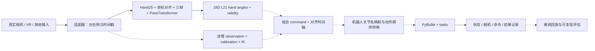
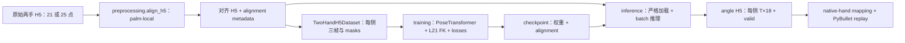

# 系统总体架构与端到端链路

## 1. 最终要实现的方向

目标是一个可复现的双臂灵巧手遥操作系统：真实摄像头、Vision Pro 或其他明确接入的
输入源产生人类动作；手部模型和双臂 IK 产生机器人命令；消费端按真实关节名驱动
仿真机器人完成任务；记录输入、命令、执行状态和结果，支持离线回放与 benchmark。

手部 production source of truth 为 **teleoperation-system**。mytrans 是迁移来源和历史
数据/权重存放位置，后续 production 手部修改在本仓库进行。机器人、任务、仿真和
应用调度沿用本仓库的职责。现有 TRON2A + L21 48D 命令路径与 H1-2 / GR1-T2 / G1
原生手 benchmark 路径需要显式映射，不能把它们当作同一个动作空间。

最终验收应同时满足：

1. 人的左右手/双臂动作确实来自真实输入，设备断开、失手和恢复行为可观察。
2. 每个转换都有明确的 topology、坐标、单位、时间戳、关节顺序和 validity 语义。
3. 手部固定 `[B,3,25,3] → [B,18]`，18D 为 root placeholder + 17 个 L21 DOF。
4. 双臂校准、IK 与 hand 输出在同一时间轴组合；各机器人动作通过关节名正确转换。
5. 仿真中执行任务、成功判定和记录可靠，能重放相同输入并比较成功率/完成时间。
6. 真实精度、物理尺度、延迟和失效保持通过人工验证；记录版本与环境以复现实验。

这是**最终方向**。目前 PR1 已完成 hand 工程合并和验证，完整实时整机闭环仍有缺口。

## 2. 当前代码能做什么

本说明依据当前源码、PR1/ENV-1/PR1.5 日志和本机环境核对。PR1 本地 commits 为
`faa3740`、`9549c72`、`328287d`；本文是其后新增的当前架构说明，不修改当次验收记录。

| 部分 | 当前能力 | 验证边界 |
|---|---|---|
| canonical hand | 转换/对齐、三帧 Dataset、训练、加载 checkpoint、导出 18D、MediaPipe realtime | 完整回归、CPU 训练/导出和 synthetic capture 已通过；真实相机尚未验收 |
| native-hand replay | L21 18D 按名字映射到 H1/GR1/G1 原生手，PyBullet 回放 | 三种机器人各 40 帧无头回放已通过；GUI/真实动作质量待人工确认 |
| benchmark 环境 | 机器人加载、任务注册、step、随机化、记录和统计 | H1/pushcube 40 步 replay 与 300 步端到端检查通过；全部任务未逐项验收 |
| TRON2A + L21 | 左右 7DOF FK/IK、calibration、48D command、离线导出与 PyBullet world | 外部 URDF 下双臂单测通过；真实校准与整机 scene replay 未做本次完整验收 |
| 旧 teleop 应用 | VR、手部、任务、记录的组织框架 | VR 当前是 mock，HandInterface 是正弦开合；不能等同于 canonical 模型已接入 |

PR1 tests：166 项，165 passed、1 skipped。历史权重缺失导致该等价性用例 skip；另用
新训练权重完成 61 次离线/实时角度比较，最大误差 `2.98023224e-07` radians。
31 个 CLI/smoke 命令检查通过。这些证据不代表硬件、所有 root entries 或所有任务均通过。

## 3. 整体链路：从输入到执行与结果

### 3.1 最终闭环总图

下图描述目标组织方式；虚线为当前仍需要整合/验收的连接。



不要把“相机 → 18D”的手部实时程序、“angle H5 → native hand”的回放程序和
“task/action → SimulationEnv”的 benchmark 程序混成一个已经接通的入口。
它们当前分别存在，下面按实际代码拆开说明连接点。

### 3.2 手部离线主链路：目前最明确的可运行路径



| 步骤 | 负责文件 | 输入 → 输出 / 注意点 |
|---|---|---|
| 原始输入 | 外部采集器；`retargeting/inputs/mediapipe.py` 提供单帧相机输入 | 每侧 `(21,3)` normalized landmarks；当前相机输入类本身不写 H5 |
| 对齐 | `retargeting/preprocessing.py`、`coordinates.py` | raw H5 → `(T,25,3)` palm-local H5；不覆盖输入，事务式替换输出 |
| 组窗口 | `data.py`、`hand_core.py`、`tracking.py` | 有效连续三帧 → 每侧 `(3,25,3)`；缺帧/无效帧重置，Dataset 提供 batch/masks |
| 训练 | `training.py`、`model/pose_transformer.py`、`kinematics.py`、`losses.py` | 共享模型分别学习两侧；原有 FK/loss 驱动训练，保存模型与坐标声明 |
| 导出 | `inference.py`、`model.py` | H5 alignment 与 checkpoint 相等才推理；输出 `(T,18)` 和 valid |
| 回放 | `scripts/replay_hand_native.py`、`teleop/native_hand.py` | 18D 原索引 → 原生手关节；其他身体关节保持姿态，不同时求解人的双臂 |

模型输入 `[B,3,25,3]`；输出 `[B,18]`。第 0 维为 root placeholder，不是可动手关节。
`angle18_to_dofs()` 只去掉第 0 维得到 17DOF；FK 的 `angle18_to_nodes()` 添加 5 个固定 tips。
native mapping 使用原始 18D 索引，不能先裁 17D 再套原表。

Hand25 topology：0 wrist；1–4 thumb；5/10/15/20 为四指 palm roots；6–9、11–14、
16–19、21–24 为对应四指。palm-local 构建 source basis 的 MCP 是 **6/11/16/21**。

`align` 只产生 `palm_local_to_l21_v1`。legacy `source_to_l21_xyz` 已对齐数据继续支持。
完整 equality 必须成立：

```text
H5 alignment == Dataset alignment == training alignment
             == checkpoint alignment == inference expected alignment
```

两种同模式组合通过；交叉、missing、empty、unknown 声明失败。不按文件名判断模式。
palm-local 为 `points25 @ B_source @ B_robot.T`，左右 robot basis 分开；source 退化 zeros、
robot 退化 fatal。不叠加 legacy、尺度归一化、平滑或历史 basis fallback。
导出无效角度沿用 hold_previous，但 valid 仍为 false。

### 3.3 手部实时链路：已经提供模型推理，尚未自动控制整机

```text
OpenCV 相机 + MediaPipe Tasks asset
  → MediaPipeCameraInput.next_frame()
      {left: (21,3) 或 None, right: (21,3) 或 None, timestamp, metadata}
  → MediaPipePalmLocalProcessor.process_frame()
      Hand25 → 每帧 palm-local → 每侧独立三帧
  → MediaPipeCameraAdapter.next_input()
      hands.left/right: (3,25,3) 或 None
  → load_palm_local_retargeter() + TwoHandRetargeter.predict()
      hands.left/right: (18,) 或 None
  → CLI 打印；或 visualization 画原始点、窗口与预测 FK
  → [待接入] command / robot adapter / task / recorder
```

MediaPipe sides 按检测标签使用，identity tracking 关闭。一侧丢失立即清空该侧历史，
恢复后重新积累三帧；另一侧可继续。camera adapter 记录 raw Unix ms，并向 payload
输出 relative seconds。相机错误释放资源并清空历史。

`python -m retargeting realtime` 不会自动创建 SimulationEnv、驱动机器人、录制数据。
`CanonicalHandProcessor` 只做 canonical 转换/窗口，**不负责坐标对齐**；自定义输入
需显式处理坐标。裸 `TwoHandRetargeter.predict()` 校验 hand shape/finite，但不会替调用方
重新做坐标变换，加载时正确 expected alignment 与真实输入来源仍由调用方负责。

### 3.4 双臂 + L21 链路：已有模块，需要资源与统一应用入口

离线结构：

```text
arm observation H5：每侧 (T,3,3) shoulder/elbow/wrist + valid
  + 同 frame_ids/timestamps 的 hand angles H5：每侧 (T,18) + valid
  + 实际 calibration JSON + 外部 TRON2A URDF
  → main_offline_dual_teleop.py
  → dual_teleop.export_robot_commands()
      ArmRetargeter → 双侧 RoboticsToolboxArmIK → ArmSafetyController
      hand 18D → 17DOF
  → structured command H5：robot_command (T,48)、各侧 q/valid、EE pose
  → main_pybullet_dual_teleop.py
  → Tron2ADualArmWorld：按关节名控制 TRON2A + 附加 L21
```

实时结构：外部 `module:factory` iterator 提供包含 `hands` 与 `arms` 的 payload →
`main_realtime_dual_teleop.py` → `DualTeleoperator.update()` → `RobotCommand`。
当前 root 实时程序打印 timestamp/arm validity，**不直接把 command 送到 PyBullet world**。
它加载 checkpoint 时未显式指定 palm-local expected alignment，沿用 loader 的 legacy guard；
不能直接把独立 palm-local realtime 的 checkpoint/输入接过去就视为兼容。

两手 camera adapter 单独不提供 arm observations；真实 shoulder/elbow/wrist 的采集、
手臂/手部同步、校准、模式绑定和 runtime 控制循环是后续连接点。
示例 calibration 为占位数据，不是实测标定；TRON2A URDF/meshes 仍是外部资产。

### 3.5 Benchmark / 仿真执行链路

```text
系统动作文件 actions.h5 / actions.npz，或 dummy controller
  → scripts/replay_actions.py：load / probe / validate_dim
  → SimulationEnv.reset()
      RobotLoader → 关节名/indices 与实际 action_dim
      task_registry → BaseTask 子类 → 场景 reset
  → SimulationEnv.step(action)
      task.apply_action(action, joint_indices)
      → PyBullet step → task.check_success()
      → SensorRecorder（启用 record 时）→ episode H5
  → MetricsTracker / replay result
```

action order 是 `[left_arm,right_arm,left_hand,right_hand]`；H1=38、GR1=36、G1=28。
48D TRON2A/L21 order 为 `[left_arm,left_hand,right_arm,right_hand]`，不能直接送进该环境。
`reset()` 后才能读取 action_dim；系统的正确映射来自 action_joint_names/indices。
dummy 动作只验证加载/执行，不证明任务完成或真实重定向效果。

native-hand replay 直接加载机器人并驱动手，不经过 SimulationEnv 的完整任务/recorder
流程。因此“手指能回放”不等同于“推物/抓取任务成功”。

### 3.6 旧 teleop 框架与数据保存

`teleop/teleop_pipeline.py` 独立组织 VRInterface + HandInterface + task/recorder。
目前 VRInterface.receive_vr_data() 返回 mock，HandInterface.get_both_hands() 返回正弦
开合；没有默认调用 canonical PoseTransformer。旧配置仍有 xArm/TRON 占位 indices。
`demo_teleop.py` 也使用 RobotJointCommand.mock_demo()，当前 apply 函数仅设置 arms。

SensorRecorder 记录仿真 joint states、物体状态与 episode metadata；H5 中相机只保存
首尾 RGB 摘要，不能据此恢复完整视频序列。
它不是自动保存 raw MediaPipe/H5/checkpoint/command 契约的统一 recorder。
完成可复现闭环还需要输入/预测/施加动作/状态的同步关系、模式/版本和 validity 记录。

## 4. 数据边界与目录

| 数据 | 结构与声明 | 主要消费者 |
|---|---|---|
| raw hand H5 | 左右 `(T,21/25,3)`，frame_ids/timestamps；source landmark space | preprocessing；输入 recorder 需另行提供 |
| aligned hand H5 | `(T,25,3)`，root `coordinate_frame=l21` 与 alignment | TwoHandH5Dataset、train、export |
| checkpoint | model state、coordinate_alignment，训练 checkpoint 另有 optimizer/scheduler 等 | model loader、warm start、export、realtime |
| hand angles H5 | 每侧 `(T,18)` angles + `(T,)` valid，frame_ids/timestamps/alignment | inspect、native/L21 replay、dual assembly |
| arm observation H5 | 每侧 `(T,3,3)` keypoints + valid | dual assembly；不由 hand model 生成 |
| structured dual H5 | `(T,48)` robot_command + 各侧 q/valid、EE pose | TRON2A world replay |
| benchmark actions | `(T,robot_action_dim)` actions，robot/task metadata | replay_actions / SimulationEnv |
| episode H5 | 仿真状态、物体轨迹、相机首尾帧与任务结果 | recorder/evaluation；还需统一完整输入与命令追踪 |

输入源 units、relative seconds / Unix ms、frame_ids 与各侧 valid 都需明确；数据长得相似
不能证明协议相同。MediaPipe normalized landmark 距离不能直接宣称是米。

```text
teleoperation-system-retargeting/
├─ retargeting/      canonical hand + 保留的 arm/command 服务
├─ model/           网络、FK、loss 的底层实现
├─ input_adapters/  应用 NPY replay
├─ config/          应用输入契约和 TRON2A 示例 calibration
├─ teleop/          旧应用框架、native mapping、回放滤波
├─ envs/            benchmark 环境、robot loader、recorder、随机化
├─ simulation/      TRON2A + L21 PyBullet world
├─ tasks/           任务实现/注册/基类
├─ utils/           评估统计
├─ scripts/         回放/展示/诊断工具
├─ tests/           hand/coordinate/应用边界回归
├─ docs/            本文与各专项说明
├─ robots/          已入库 from_teleopbench 模型
├─ dataset/robot/   已有 L21 FK/手部模型资产
├─ datasets/        系统协作数据（特定数据扩展名允许入库）
├─ data/            本地采集/episode 数据，忽略
└─ outputs/         本地训练/导出/smoke，忽略
```

`model/` 定义算法本身，`retargeting/model.py` 封装加载与调用。
`retargeting/simulation.py` 只是 hand angle adapters，根 `simulation/` 才是 TRON2A scene。
`.venv` 是本机环境，不是源码；未随 PR1 适配成完整 hand 环境。

## 5. 各个源码文件的作用

以下按当前 Git 管理的 Python 文件分类；资产、缓存、生成物不逐文件罗列。
路径均相对于项目根；入口里的参数用 `--help` 查阅。

### 5.1 根入口与依赖文件

| 文件 | 作用 / 当前限制 |
|---|---|
| `main.py` | 交互/task/demo/benchmark 应用入口；episode reset 后控制器读取实际 action_dim，demo 默认 pushcube 三次 |
| `demo_teleop.py` | mock RobotJointCommand → H1 展示，当前应用 arms，不是 hand 模型联动 |
| `main_train_twohand.py` | wrapper → package CLI train |
| `main_offline_twohand.py` | wrapper → package CLI export |
| `inspect_angle_h5.py` | compatibility wrapper，转发 `retargeting.cli.main(["inspect", *argv])`，复用正式 inspect 契约 |
| `main_offline_dual_teleop.py` | wrapper → 双臂 observation 与 hand angles 离线组合 |
| `main_realtime_dual_teleop.py` | 外部 iterator → DualTeleoperator → 打印 command 信息；不发送 world |
| `main_pybullet_dual_teleop.py` | structured dual H5 → TRON2A/L21 GUI 回放 |
| `show_all.py` | 三种机器人并排模型展示 |
| `show_hand.py` | 单独展示 LinkerHand，依赖外部 SDK 资产 |
| `test_camera.py` | 手动摄像头采集/预览入口，非 unittest suite |
| `test_import.py` | 六项应用检查，含 H1 300 步；需检查输出中的 FAIL，不能只看退出码 |
| `requirements.txt` | application：PyBullet、NumPy、SciPy、h5py |
| `requirements-retargeting.txt` | hand runtime：Torch、FK/URDF 与数组处理等 |
| `requirements-retargeting-training.txt` | runtime + TensorBoard |
| `requirements-retargeting-camera.txt` | runtime + MediaPipe、OpenCV contrib |
| `requirements-retargeting-tools.txt` | runtime + Matplotlib、OpenCV contrib |
| `requirements-dev.txt` | application/training/tools + robotics toolbox/spatialmath；不包含 camera requirements 全部依赖 |
| `environment.yml` | ENV-1 正式 Conda teleoperation 声明：Python 3.10.20、已验证直接依赖版本，引用 dev/camera requirements |
| `README.md` | 系统简介与当前文档入口 |

### 5.2 retargeting 与底层 model

| 文件 | 作用 |
|---|---|
| `retargeting/__init__.py` | 暴露 L21 config 与 lazy hand angle adapters |
| `retargeting/__main__.py` | `python -m retargeting` 的入口 |
| `retargeting/cli.py` | 五个 hand subcommands 的 lazy parser/dispatch |
| `retargeting/config.py` | hand topology/dimensions、模型/训练/runtime defaults、L21 URDF 与路径 |
| `retargeting/runtime.py` | auto/cpu/cuda device 选择与可用性检查 |
| `retargeting/contracts.py` | hand/arm payload 校验、构建、VisionPro 兼容、保留的 action helpers |
| `retargeting/tracking.py` | wrist-relative、21→25、身份连续性与 HandWindowBuffer |
| `retargeting/hand_core.py` | Raw/CanonicalHandFrame、HandWindow 与 canonical processor；坐标对齐在外部 |
| `retargeting/coordinates.py` | legacy matrix、palm bases/变换、alignment 标识校验 |
| `retargeting/preprocessing.py` | H5 palm-local preprocessing、保留数据属性、事务式替换 |
| `retargeting/data.py` | 两种 H5 schema 读取、严格 metadata、Dataset、窗口与 batch generator |
| `retargeting/training.py` | split/优化/验证/有限值检查、warm start、checkpoint 与训练日志 |
| `retargeting/model.py` | build/load checkpoint、TwoHandRetargeter、predict；坐标校验在加载边界 |
| `retargeting/inference.py` | batch 离线预测、angle validity、hold_previous、H5 export |
| `retargeting/inspect.py` | 检查 angle schema、finite、限位、valid 和属性 |
| `retargeting/retargeter.py` | HandRetargeter 抽象与 PoseTransformer adapter；DexRetargeting 类仅占位，会抛 NotImplementedError |
| `retargeting/inputs/__init__.py` | 原始输入子包入口 |
| `retargeting/inputs/mediapipe.py` | Camera/VIDEO Tasks、左右 label 解析、raw21 与资源生命周期；不做窗口/变换/录制 |
| `retargeting/mediapipe.py` | raw21 palm-local processor、camera adapter、严格 palm checkpoint 加载、console realtime |
| `retargeting/visualization.py` | realtime 可视化、L21 FK、headless snapshot 与资源释放 |
| `retargeting/plotting.py` | 仅用于显示的投影/文字/骨架绘制 |
| `retargeting/simulation.py` | AngleFrame、18→17、18→23 FK nodes、angle H5 iteration |
| `retargeting/visionpro.py` | VisionProStreamer 或注入 streamer → legacy hand points/window；不是 arm collector |
| `retargeting/arm.py` | TRON2A URDF specification、双侧 ETS/FK/IK、calibration、arm retarget/safety controller |
| `retargeting/command.py` | 现有固定 7+17+7+17 RobotCommand 与 validity、flatten |
| `retargeting/dual_teleop.py` | 对齐 observation/angle 时间轴，arm IK + hand17 → structured command H5 |
| `retargeting/realtime_dual_teleop.py` | DualTeleoperator：一个含 hand/arm payload → 48D 结构命令 |
| `model/pose_transformer.py` | 网络 spatial/temporal attention 与 angle limit 输出 |
| `model/kinematics.py` | URDF parsing、手部可微 FK；原有数学保留 |
| `model/losses.py` | 手部位置/向量/碰撞/拇指/tip distance/reg 等 canonical loss |

### 5.3 应用、仿真、任务与接口

| 文件 | 作用 / 注意点 |
|---|---|
| `input_adapters/npy_replay_adapter.py` | NPY frame dict → canonical processor → hand payload；本身不做 palm-local 对齐 |
| `config/retarget_io.py` | 应用 hand helper 委托 canonical，保留 partial action packing 与 arm 容器行为 |
| `config/tron2a_dach_calibration.example.json` | calibration 字段示例；不能当实测校准直接验收 |
| `teleop/__init__.py` | 应用包 exports；导入包会加载 VR/Hand/Pipeline，间接依赖 PyBullet |
| `teleop/teleop_pipeline.py` | 旧 VR + hand + task + recorder 调度；仍有占位机器人配置 |
| `teleop/vr_interface.py` | mock VR wrists → robot frame → PyBullet IK；真实接收待接入 |
| `teleop/hand_interface.py` | 模拟 L21 正弦开合 + joint-name motor 控制，不调用 PoseTransformer |
| `teleop/camera_interface.py` | RGB/BGR 采集与预览，不做 MediaPipe hand inference |
| `teleop/pipeline_data.py` | CameraFrame、另一 RobotJointCommand、TeleopEpisode；command 保存存在 hand 丢失问题 |
| `teleop/native_hand.py` | L2118 原始维度 → H1/GR1/G1 hand 关节名、符号、限位映射 |
| `teleop/filters.py` | 回放流异常/identity swap 检查、repair、moving average/Kalman 等；不属于 palm-local 几何算法 |
| `envs/__init__.py` | benchmark 环境组件 exports |
| `envs/simulation_env.py` | reset/step/episode、任务/记录/随机化/评估组合；action_dim 在 reset 后确定 |
| `envs/robot_loader.py` | 加载三种机器人，按名字收集 arm/hand 并生成 action names/indices |
| `envs/sensor_recorder.py` | episode joint states、objects、相机首尾 RGB 摘要与任务 metadata 写 H5 |
| `envs/domain_randomizer.py` | 场景物体/物理/视觉随机化 |
| `simulation/__init__.py` | TRON2A PyBullet adapter 包入口 |
| `simulation/pybullet_world.py` | 解析 TRON2A joint/link 名、挂 L21、apply/step/close；apply 不按 validity 分支 |
| `tasks/__init__.py` | registry functions exports |
| `tasks/task_registry.py` | register/get/list、按难度 level 查询 |
| `tasks/base_task.py` | task reset、物体创建、动作应用、success 抽象；缺 indices 会按位置 fallback |
| `tasks/all_tasks.py` | 30 个任务类的物体、初始场景与成功条件；需要逐任务物理验证 |
| `utils/__init__.py` | metrics exports |
| `utils/metrics.py` | 成功率、完成时间、任务统计与输出 |

### 5.4 scripts 工具

| 文件 | 作用 |
|---|---|
| `scripts/align_h5_coordinates.py` | 正式 preprocessing 的兼容 wrapper，现在输出 palm-local |
| `scripts/replay_actions.py` | 系统 actions 文件或 dummy → SimulationEnv，维度检查、可选记录 |
| `scripts/replay_hand_native.py` | hand angles → 三种机器人的原生手回放，支持 mapping report / no-repair、左右手特写、帧区间和按时间戳调速 |
| `scripts/replay_hand_angles.py` | hand angles → 独立 L21；SDK asset 依赖、可选 repair/smoothing |
| `scripts/replay_hand_on_robot.py` | 将 L21 挂到 robot wrist 的实验回放；不同于原生手 mapping |
| `scripts/show_hands_all.py` | 三机器人原生手动作并排展示/映射对比 |
| `scripts/make_sample_data.py` | 早期契约 G/H 的示例数据生成；不是新 canonical 两手 H5 recorder |
| `scripts/validate_retarget_input.py` | NPY adapter 输出的 canonical payload 形状/合法性检查 |
| `scripts/verify_hand_pipeline.py` | 旧 angle 数据→检查→L21 回放验收汇总，默认数据/SDK 需自备 |
| `scripts/verify_p0.py` | 严格加载 checkpoint，双侧推理/FK/loss/backward 与文件 hash 审核 |
| `scripts/diagnose_hand_coordinates.py` | H5 坐标、chirality、scale/units、metadata 的只读诊断 |
| `scripts/compare_training_hand_pose.py` | matching checkpoint 前后 FK 与 target 的静态图片比较 |
| `scripts/visualize_hand_keypoints.py` | 读取训练使用的 keypoints/window 并绘图 |
| `scripts/visualize_l21_fk.py` | 根据已有 URDF 可视化 L21 FK nodes |
| `scripts/check_gbk_safe.py` | 源文件中 GBK 无法编码的字符检查；不是运行功能测试 |

### 5.5 tests 文件

| 文件 | 保护内容 |
|---|---|
| `tests/hand_fixtures.py` | 确定性 synthetic hand/缺帧/跳变/非有限 fixtures |
| `tests/test_align_h5_transaction.py` | 输入/已有输出保护、hardlink、Windows 文件占用、metadata、写入失败与原子替换 |
| `tests/test_angle2real.py` | URDF root、完整 FK topology、缺失关节错误 |
| `tests/test_application_entrypoints.py` | 三机器人真实 reset/action/step，demo/task/benchmark/交互 CLI、冲突参数、每 episode 一次 reset |
| `tests/test_cli.py` | hand commands、目标默认 checkpoint、device 与 inspect 错误 |
| `tests/test_cli_integration.py` | lazy CLI、synthetic realtime/headless 图像、capture 资源释放 |
| `tests/test_coordinate_contracts.py` | legacy directions、chirality、显式 source/robot scale、loss 单位行为 |
| `tests/test_coordinate_diagnostics.py` | diagnostics metadata/units，未声明不猜单位 |
| `tests/test_coordinate_modes.py` | 两种变换、proper basis、MCP/左右参考、刚体不变性、距离和退化 |
| `tests/test_coordinate_pipeline.py` | H5/checkpoint 四向 matrix、缺失/未知 metadata、warm start、save、training 传播 |
| `tests/test_diagnostic_alignment.py` | 比较工具与 P0 verification 的 strict loading |
| `tests/test_dual_arm.py` | 外部 TRON2A 两侧 7DOF、当前 pose IK、48D 离线导出与 invalid arm hold |
| `tests/test_hand_application_integration.py` | NPY dropout、VisionPro、三机器人 native 18D index、保留的 app packing |
| `tests/test_hand_core_regression.py` | topology、chronological windows、offline/realtime、root→17、invalid export |
| `tests/test_hand_retargeter.py` | 抽象接口 adapter、HandCommand 与 missing-side validity |
| `tests/test_input_adapters.py` | hand/arm/legacy VisionPro payload、identity tracking |
| `tests/test_inspect_wrapper.py` | wrapper/package CLI 的 help、合法 H5、缺文件及 invalid schema 一致性 |
| `tests/test_losses.py` | tip distance batch 不变性、拇指 atan2 数值/梯度和退化 masking |
| `tests/test_mediapipe_input.py` | labels/raw21/finite、VIDEO timestamp、camera initialization 与 release |
| `tests/test_mediapipe_realtime.py` | 每侧 reset/recovery、basis 构建、offline/streaming 等价、strict palm loader |
| `tests/test_native_hand_replay.py` | 真实三机器人 sentinel 目标、view/speed/range/loop/validity 不变，修复上下文与参数错误 |
| `tests/test_offline_twohand.py` | angle limits/finite 与 hold policy |
| `tests/test_simulation.py` | hand angle adapter 顺序/shape 与 H5 validity |
| `tests/test_training_safety.py` | nonfinite loss/gradient/norm 拒绝 optimizer update |
| `tests/test_twohand_h5_dataset.py` | root schema、Hand25、missing side、masks、identity reset |
| `tests/test_twohand_retarget.py` | 共享模型双侧预测与单侧 missing |

tests 不等于 root 文件/所有硬件/所有任务已覆盖。历史权重等价性用例可显式 skip；外部
TRON2A 未提供会报资源错误，不能把这两种情况混为算法通过。

## 6. 如何运行与调用

### 6.1 本机已验证环境

```powershell
Set-Location D:\2026\code\teleoperation-system-retargeting
conda activate teleoperation
python -c "import sys; print(sys.executable)"
$projectPython='D:\Anaconda\envs\teleoperation\python.exe'
& $projectPython -m retargeting --help
```

ENV-1 正式环境为独立 Conda `teleoperation` / Python 3.10.20，按原 requirements 从零
建立，已通过完整 tests、真实 CPU hand 导出、训练 smoke、PyBullet 和双臂 FK/IK。
用户已将 Torch 替换为 2.14.1+cu130，配套 torchvision 0.29.1+cu130；NumPy 1.26.4、
SciPy 1.13.1，OpenCV 仅 contrib 4.11，pip check 正常。RTX 4050 / driver 581.80 上
CUDA tensor、真实 6515 帧 hand 导出及 1 epoch 训练 smoke 通过；PR1.5 完整 tests 180 通过、
1 skip。完整 CUDA training、GUI 和真实相机未验收，当前 CUDA 声明的从零重建未复验。
PyCharm interpreter 用该路径，Working directory 用项目根。终端先激活环境
（`conda activate teleoperation`），或显式使用 `$projectPython`；仓库 `.venv` 为
3.13.1 且缺核心依赖。

旧 TransHandR 保持不变，仅作为 reference baseline；其版本差异不再作为正式项目
环境的安装方式。重建使用根目录 `environment.yml`，具体版本、验证结果和边界见
[正式环境说明](ENVIRONMENT.md)。requirements 六个文件没有修改，正式声明仅固定
新环境验收过的直接依赖，未导出整个旧环境。
真实 VisionPro adapter 还需外部 `avp_stream`；目前 requirements 没有覆盖该硬件分支。

### 6.2 已存在的历史数据/权重如何交给新代码

下面两个已有文件均实查声明 `palm_local_to_l21_v1`。调用的源码仍来自新项目根；
mytrans 路径仅用于读取 artifact，不要求修改/复制 source repo。

```powershell
$handInput='D:\2026\code\mytrans\input\palm_local_visual_hand_data_20261005_002654.h5'
$handCheckpoint='D:\2026\code\mytrans\checkpoint\models\twohand_h5\linker\palm_local_v2\model_best.pth'
$angleOutput='D:\2026\code\teleoperation-system-retargeting\outputs\hand_retargeting\palm_angles.h5'
& $projectPython -m retargeting export --input $handInput --checkpoint $handCheckpoint --output $angleOutput --device cpu
& $projectPython -m retargeting inspect --angle-h5 $angleOutput
& $projectPython 'D:\2026\code\teleoperation-system-retargeting\scripts\replay_hand_native.py' --file $angleOutput --robot h1_2 --hand both --render --loop 1 --no-repair
```

最后一条是需人工观察的 GUI replay；PR1 自动 smoke 使用 DIRECT。各文件没有随 PR1
迁移，其他机器需要提供自己的 artifact。training/align/realtime 参数详见
[hand 文档](HAND_RETARGETING.md)；当前两仓库根没有 hand_landmarker.task，先准备 asset。

若全量播放看不清动作，先关闭旧 GUI，使用实际手部特写和半速循环：

```powershell
& $projectPython 'D:\2026\code\teleoperation-system-retargeting\scripts\replay_hand_native.py' --file $angleOutput --robot h1_2 --hand both --render --view left-hand --start-frame 2640 --end-frame 2940 --speed 0.5 --loop 0 --no-repair
```

此帧区间仅针对上面的本机导出，对应左手约 95–105 秒，300 帧均有效。左手蓝色、
右手橙色；`--end-frame` 为不包含的结束帧。全量记录约 224 秒，仅约一半帧有有效
预测，其余保持上一输出。四指存在明显变化，但拇指两个预测关节近乎固定；输入与
预测的对应质量仍需人工判断。观察选项不改变模型输出或映射，不能替代算法验收。
检测与已有修复使用完整记录后再选区间，同一原始帧的目标不随 clip 边界改变；
`--no-repair` 直接使用原始导出值。speed 改变 GUI 等待节奏，loop 重复相同目标，
不增加动作幅度；实际物理跟踪仍需 GUI 人工观察。

### 6.3 应用无头验证与 Python API

```powershell
python main.py --demo --no-render --no-record
python main.py --task pushcube --robot h1_2 --no-render --no-record
python inspect_angle_h5.py --angle-h5 outputs/env_checks/palm_angles.h5
python -m retargeting inspect --angle-h5 outputs/env_checks/palm_angles.h5
& $projectPython 'D:\2026\code\teleoperation-system-retargeting\scripts\replay_actions.py' --dummy --robot h1_2 --task pushcube --no-render --steps 40
& $projectPython 'D:\2026\code\teleoperation-system-retargeting\test_import.py'
# 完整 tests 的三项 arm 用例需要实际外部 URDF，路径按本机调整：
$env:TRON2A_TEST_URDF='D:/2026/code/mytrans/third_party/tron2-robot-description/tron2a/DACH_TRON2A/urdf/robot.urdf'
& $projectPython -B -m unittest discover -s tests -v
```

程序内 hand 接入：初始化一次 MediaPipePalmLocalProcessor 与 load_palm_local_retargeter，
循环 process_frame(raw21) → 非 None payload 时 predict → 18D/None。处理器不能每帧重建。
typed boundary 用 HandWindow + PoseTransformerRetargeter → HandCommand。
应用接入用 SimulationEnv.reset() → 读取实际动作空间 → 显式 mapping → step(action) → close()。
这两层之间的 command/time/validity adapter 是待统一的连接点，不要直接拼接数组猜顺序。

`main.py` 的 `--task` 单次运行，`--demo` 默认 pushcube 三次演示，`--demo --task NAME`
在指定任务演示；`--benchmark` 运行 Level 1 并使用 `--trials`，不能与 demo/task 同用。
不传模式进入原有交互菜单。controller 先绑定环境但不读取动作维度，run_episode 内
reset/load robot → 获取 joint names/indices/dim → callback 生成有限 ndarray → step。
每个 episode 只有一次 reset。重复 reset 的地面资产使用绝对路径，避免机器人搜索路径覆盖。
现有每 episode 最多 10000 步；耗尽步数可返回失败且不记录 metrics，演示能退出不等于任务成功。
上述完整无头入口用 `--no-record` 验证通过。默认记录模式的五步/episode CLI 回归通过，
但原始长程 smoke 未通过：逐步双相机缓存导致两个进程合计约 20 GB 内存，demo native
crash、task 被主动停止；不能将其写成默认记录链路正常，需独立诊断。

## 7. 需要人工验证的地方

下表默认未完成真实设备/物理验收；synthetic 单测不能代替这些步骤。

| 环节 | 人工怎么验证 | 通过标准 / 需记录的证据 |
|---|---|---|
| 相机与 MediaPipe | 提供 Tasks asset、确认 camera index，左右单手/双手、遮挡、出入画面 | 左右 label/21 点正确；记录帧率、设备/版本；关闭后资源释放 |
| 缺帧恢复 | 左手离开后返回，右手持续可见 | 左侧立即失效、重新三帧后输出；右侧不被连带清空；留日志/视频 |
| 手部坐标 | 看 raw/palm/FK overlay，旋转掌面、镜像场景、开合各指 | 左右不反转，MCP 方向正确；分清 normalized 与 meters，实测比例/长度 |
| 手部质量 | 固定手势与连续动作，对比真实目标和预测 FK | 记录误差、抖动、延迟、限位触碰与缺侧 valid；不能只凭图好看 |
| native 映射 | H1/GR1/G1 各 GUI 回放，逐指屈曲/拇指动作 | 无错误侧/方向/关节；记录丢弃 DOF 和 clamp；身体不被手部索引误触 |
| arm calibration/IK | 实测中立 pose、单位/轴、tool/mount，左右独立运动、workspace 边界 | EE 误差/limits/continuity 达标；IK 失败和 tracking timeout 保持策略符合预期 |
| TRON2A scene | 配置真实 URDF/meshes 与 mount，播放 structured commands | 双臂/L21 挂载方向正确、左右独立、invalid policy 明确；日志/视频记录 |
| 实时整机 | 同步真实 arm+hand observation，接 command 到对应 robot consumer | 时钟不混用、flags 传播、失手/断流可控；测端到端延迟与持续运行稳定性 |
| 任务 | 每个目标 task 实测接触/抓取、成功/失败/超时、随机化 | 人工观察与 check_success 一致；30 个注册类不能当作 30 个已验证物理任务 |
| recorder/replay | 开 record 完成一集，校对输入/命令/状态/相机，再重放 | 字段/顺序/单位/版本/时间轴完整，可恢复同类结果；hand 数据不可丢失 |
| 新环境/GPU | 在隔离环境按 requirements 安装，CPU/GPU 分别 train/export | 依赖约束一致、完整 tests/smokes 通过；记录 driver/Torch/CUDA 与硬件 |

验证结果建议写到独立的日期记录，包含输入文件/权重 hash、commit、完整命令、实际环境、
预期/观察结果和 PASS/FAIL。遇到失败先确定输入、转换、模型、映射、场景或记录哪层出错。

## 8. 当前存在的问题与缺口

| 问题 | 源码证据 / 影响 | 下一步 |
|---|---|---|
| **RESOLVED — PR1.5**：main action_dim 初始化 | 旧代码 reset 前缓存 None，np.zeros(None) 为标量；现改为 controller 在 run_episode reset 后读取实际维度 | H1/GR1/G1 真实 step、合法 shape/finite、reset/recorder 次数回归通过，无 double reset |
| **RESOLVED — PR1.5**：单独 `--demo` no-op | 现复用默认 pushcube，执行原有三次 evaluate_task；显式 task 优先选择演示任务，benchmark 与 demo/task 互斥 | 完整 no-record smoke 与含默认记录模式的 bounded CLI 回归通过；地面绝对路径同时解决第二次 reset 资产查找失败；长程默认记录另列未通过 |
| **RESOLVED — PR1.5**：inspect wrapper | 现仅转发 retargeting.cli.main 的 inspect 子命令，不复制实现、不吞异常 | wrapper/package help、合法 H5、缺文件、invalid schema 一致；ENV-1 6515 帧 H5 两入口通过 |
| **NOT VALIDATED**：hand model/FK visual quality | 工程链可运行，但 predicted FK 与人手输入仍有差异，thumb motion 可能不足；观察到两个拇指预测关节近乎固定 | 保留独立 hand model quality diagnosis；PR1.5 不修改模型、FK、loss 或训练，手指能动不代表重定向准确 |
| 实时闭环未统一 | hand realtime 只预测；dual realtime 只输出信息；旧 TeleopPipeline 使用 mock | 显式接 adapter→command→robot/world→task→recorder，避免复制手部算法 |
| alignment 模式跨应用绑定缺口 | dual realtime 沿用 legacy loader 默认；NPY/CanonicalHandProcessor 不自动对齐 | 为来源/模型显式绑定 mode；保持错误模式 fatal，不能关 guard |
| command/order/dim 分歧 | 48D 与 benchmark 顺序/维度不同；partial helper 可输出 34D；两种 command 数据类并存 | PR2 统一 structured boundary 与 per-robot converter，见 PR2_FOLLOW_UP |
| validity 控制语义不统一 | angles hold_previous 仍 invalid；world.apply 直接施加数组；各 consumer 行为需明确 | 定义丢失/IK 失败/timeout 的 flags 与保持策略并联调 |
| 硬编码 arm indices | 旧 TRON2_CONFIG 左右 indices 都 0–6、EE 都 7；PyBullet IK 返回值索引含义需核对 | 按实际 joint names/link names 建映射，区分 IK vector 与 PyBullet index |
| command serialization 丢 hand | teleop/pipeline_data.py 的 RobotJointCommand.save/load 只写/读 arms/timestamp | 完整保存 hand 与 metadata，增加 round trip 验证后统一 recorder |
| episode 记录不足以恢复完整输入流 | SensorRecorder 只存相机首尾帧摘要，没有完整 raw hand/command 流关联 | 定义完整采集/命令/状态时间轴与存储成本，验证可复现回放 |
| **未通过**：默认记录的长程 main smoke | 每步缓存两路 RGB/depth/seg，本机 PyBullet 返回 tuple，五步探测新增一步约 11 MB，外推 10000 步约 103 GiB；首次并发 smoke 合计约 20 GB，demo 以 0xC0000005 退出，task 约 11 GB 时主动停止；native crash 根因未确认 | 独立诊断 recorder/资源使用与 native crash，串行复跑原始 main 命令后再放行；PR1.5 未修改 recorder，也未静默关闭默认记录 |
| 资产/校准不完整 | TRON2A 外部、SDK 独立依赖、Tasks asset 缺失、example calibration 为占位 | 记录获取/版本/配置；实测校准与 mount，不靠示例零值证明完整运行 |
| 环境验收边界 | ENV-1 已从零建立 teleoperation，并按 environment.yml 重建通过；间接依赖未完整 lock | 正式使用 teleoperation；其他平台、CUDA wheel 和未来间接依赖组合仍需重验，见 ENVIRONMENT |
| 演示/任务质量未证明 | mock、synthetic checkpoint、native 有损映射；H1 smoke clamp 16.67%；dummy pushcube 未成功 | 人工验证精度/物理尺度/真实任务，建立客观指标 |
| 历史文字与部分代码注释过时 | 旧路径/文件数/环境说明，SimulationEnv.step docstring 仍写旧 28D | 文档以本说明为入口；维护时更新相关注释，执行维度以 reset 后实际值为准 |
| 覆盖范围有限 | PR1.5 已补 root main/inspect/replay 覆盖；test_import 仍可打印 FAIL 但 exit 0；全部 task/硬件未验收 | 入口 smoke 检查输出与退出码；当前 benchmark 回归只验证每任务五步路由，不代表任务质量通过 |

上述入口问题的历史复现记录仍在本机 ignored `outputs/docs_checks/`；PR1.5 的正式
验收统一使用 Conda teleoperation，日志在 `outputs/pr15_checks/`，结果见
[PR1.5 验收报告](PR15_APPLICATION_ENTRY_RESULT.md)。PR1 历史验收报告保持当次事实。

## 9. 后续推进顺序

1. PR1.5 已完成三项入口修复与回放回归；先独立诊断默认记录长程 smoke，再放行 PR2。保留可运行的 no-record/离线主路径。
2. ENV-1 已完成依赖干净安装与重建验收；继续完成资产配置、相机与各机器人 native 手的人工观察。
3. PR2 统一 command schema、order、validity、joint-name mapping 与 per-robot converter。
4. 采集真实双臂 observation，完成 calibration/IK/mount 验证，接入同步 hand+arm 实时循环。
5. 将控制、任务和记录连成闭环，验证 recorder round trip；逐任务做物理/成功条件验收。
6. 固定版本/数据/seed/时间指标，再做可复现 benchmark；硬件控制与实物性能需独立验收。

专项说明与历史文档的优先级见 [文档索引](README.md)。PR1.5 修改应用入口与回放控制，
未改变 hand contract、模型/FK/loss、训练、RobotCommand、arm IK 或 benchmark action converter。
