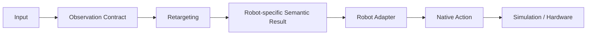

# 架构与模块边界

生产包是 `src/teleoperation`。完整工作流仅在 `applications` 中组装，CLI 使用静态命令注册并延迟导入应用 handler。



## 模块职责

| 模块 | 职责 | 边界 |
|---|---|---|
| contracts | 简单类型、声明、shape 与 validation | 仅标准库和 NumPy；不处理模型或文件工作流 |
| inputs | 获取和解析传感器原始结构 | 不变换坐标，不做 21→25、跟踪、窗口或推理 |
| retargeting | 坐标、拓扑、跟踪、时间算法、网络、FK、IK、安全控制 | 不运行设备，不选择任务，不依赖 learning |
| robots | 特定机器人的规格、手部映射、native action 编码 | 不读取人体 landmarks，不复制跨机器人手臂角 |
| simulation | 加载和执行机器人、任务、随机化、状态采集 | 不加载手部 checkpoint 或训练模块 |
| learning | Dataset 构建、loss、优化、epoch 计算 | 可用手部算法与数据读取；运行组装在 apps/training |
| data | schema、读写、序列化、事务、记录缓存 | 不调用对齐、滤波、推理、IK 或设备采集 |
| apps | 创建组件、按顺序调用、循环、同步、关闭资源 | 不实现坐标、IK、网络或关节映射公式 |
| tools | 绘图、显示、报告格式化 | 不独立组织业务流程 |

`inputs/replay` 只逐帧读取 NPY；`learning/dataset` 允许调用单帧处理与时间缓冲来构建样本。二者都不调用应用层。

## 手部链路

```text
MediaPipe / VisionPro / Replay
    → RawHandFrame
    → CanonicalHandProcessor.process_frame
    → CanonicalHandFrame
    → TemporalBuffer.append
    → HandWindow
    → PoseTransformerRetargeter.retarget
    → HandRetargetResult / L21HandAngles[18]
    → 显式去掉 placeholder
    → L21HandDOFs[17]
    → NativeHandAdapter
    → 原生机器人手部目标
```

`apps/hand_processing.py` 清楚展示采集、单帧处理与缓冲之间的连接。`CanonicalHandProcessor` 只持有 identity tracking 等单帧状态；`TemporalBuffer` 只持有已规范化帧。处理器与缓冲器分别重置。

MediaPipe palm-local 使用独立的 `MediaPipePalmLocalProcessor`：逐帧对齐，不启用 identity tracking，单侧失效立即清空该侧历史。hand 与 dual 复用 `apps/hand_processing.py` 的 `MediaPipePalmLocalPipeline`。原始 Unix 毫秒保留在 input；relative seconds 仍由 hand 摄像头应用用原先的 `round(time.time() - start, 3)` 计算。

NPY 保留关闭跟踪、缩放和缺失清空行为；H5 Dataset 保留跟踪配置、frame gap 重置、timeline 和 mask；Vision Pro 输入返回原始矩阵，坐标提取发生在 retargeting/topology，没有新样本时不更新缓冲。dual realtime 显式选择 legacy 或 palm-local；输入声明与预处理、checkpoint 必须精确匹配，未知空间拒绝处理。

`retargeting/hand/angles.py` 保留原有 float32 的 18→17 转换。原生回放先保留 float64 修复与平滑，再通过 `L21HandAngles.native_mapping_dofs()` 仅切掉占位维。原生映射仍依据原 18D 索引，取 17DOF 时显式使用索引减一。

## 双臂链路

```text
UpperBodyObservation
    → Calibration + ArmRetargeter
    → ArmTargetPose[xyz + xyzw]
    → ArmIK
    → ArmIKResult[q7, success, errors]
    → ArmSafetyController
```

上身关键点、末端 pose、IK 关节角不能以裸数组互相冒充。实时观测严格检查结构和有限值；离线无效观测保留上一目标。IK 失败保留 previous q 和 inf 误差；安全控制仍按原有成功标志与时间戳处理。

`apps/dual.py` 接收原始组合观测，手部与双臂分别处理，再组装 `Tron2AL21Command`。机器人层不解释人体 landmarks。

## 机器人动作与执行

TRON2A/L21 固定 `[LA7 | LH17 | RA7 | RH17]`，使用严格拼接或 `Tron2AL21ActionAdapter`。H1/GR1/G1 使用自己的原生关节语义目标和各自动作适配器，动作顺序仍由实际加载的 `action_joint_names` 表达。

`pack_partial_limb_vector()` 只返回 `PartialLimbVector`，没有自动 NumPy 转换。正式适配器拒绝 partial；`SimulationEnv.step` 在关节下发和物理步进之前拒绝 partial、错误维度与非有限动作。`None` 保留原行为。

## 文件与记录流程

```text
apps/hand_align
    → data/hand_h5 读取 schema 与声明
    → retargeting/hand/alignment 和 coordinates 计算
    → data/hand_h5 写入
    → data/transaction 关闭后 os.replace
```

事务使用同目录临时文件，失败清理自己的临时文件；输入与输出不能指向同一文件。历史 schema、metadata 与数据精度沿用已有实现。

```text
simulation/sensors.collect
    → SimulationSample
apps/simulation.EpisodeRecording
    → data/recorder 缓存与保存
```

仿真环境通过注入的 recording observer 发出原有采集时点事件；应用 observer 连接采集与持久化。`data/recorder` 不导入 PyBullet，也不查询机器人或相机。使用 `apps/simulation.create_environment()` 创建带录制的应用环境；直接构造 `SimulationEnv(record=True)` 需提供 recording observer。episode、evaluation、benchmark 循环位于 `apps/simulation.py`。

checkpoint 的文件序列化位于 `data/checkpoint`，state_dict 选择、严格加载和坐标 guard 位于 `retargeting/hand/checkpoint`。仿真只使用机器人和资源配置。

## 入口迁移

| 原入口 | 当前命令 |
|---|---|
| main.py | sim run |
| demo_teleop.py | sim demo-joints |
| main_train_twohand.py | hand train |
| main_offline_twohand.py | hand export |
| inspect_angle_h5.py | hand inspect |
| scripts/align_h5_coordinates.py | hand align |
| main_offline_dual_teleop.py | dual export |
| main_realtime_dual_teleop.py | dual realtime |
| main_pybullet_dual_teleop.py | dual replay |
| scripts/replay_actions.py | replay actions |
| scripts/replay_hand_native.py | replay native-hand |
| scripts/replay_hand_angles.py | replay l21-hand |
| scripts/replay_hand_on_robot.py | replay mounted-hand |
| show_all.py / show_hand.py / scripts/show_hands_all.py | tools show-robots / show-hand / show-all-hands |
| test_import.py / test_camera.py | tools check-environment / check-camera |
| 其他 scripts 工具 | tools 文件名去扩展名、下划线转连字符 |

不保留旧路径 Python wrapper。静态架构测试检查直接导入、重导出后的传递依赖、受控动态导入和 partial 的生产调用位置。

## 目录迁移时的验证范围（历史）

按用户最新要求不使用冻结基线进行验收。仅执行语法、导入、CLI 帮助、包构建与架构规则检查；没有执行迁移后的数值或物理回归。现有行为测试保留并迁移导入、mock 目标和命令，容差不放宽。后续由用户运行完整 unittest 和真实工作流。摄像头、CUDA 与外部 TRON2A URDF/mesh 的运行情况仍需实际验证。

后续 current-state 数值回归、物理 smoke 与实时坐标契约修复的实际结果见 [2026-10-09 验收报告](current-state-validation-2026-10-09.md)。
