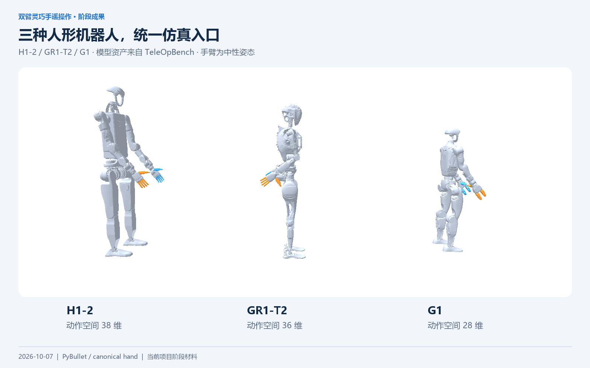
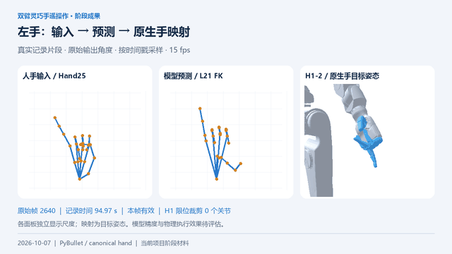
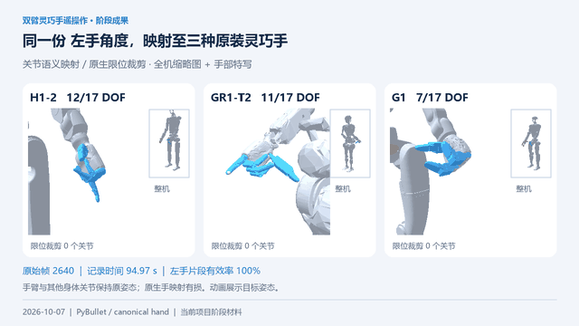

# 大创项目阶段成果包

**双臂灵巧手遥操作仿真与手部动作重定向** · 中山大学大学生创新创业训练计划项目  
整理日期：2026-10-07；代码基准：`c57c165`。面向阶段汇报、答辩和团队展示。

当前已形成三机器人仿真框架、30 个分层任务定义、统一手部重定向工程链路，以及三种原装手映射展示。已有回归测试和真实记录导出证据；整机实时闭环、模型精度与任务成功率仍需进一步验收。

## 阅读与播放

- [完整阶段成果材料](项目阶段成果.md)：汇报正文、成果表、验证数据和后续安排。
- [图片与视频展示页](index.html)：用浏览器打开；支持图片浏览、MP4 控制播放和 GIF 预览。
- [素材说明](素材说明.md)：数据来源、帧区间、生成方式、展示口径和复现方法。
- [素材元数据](素材元数据.json)：输入与输出 SHA-256、软件版本、视频参数和解码检查。
- [验收结果](验收结果.json)：素材数量、全部视频解码、链接完整性和输入保护检查。

将整个 `present` 文件夹复制到另一台电脑即可查看文档、图片、MP4 与 GIF，无需 Python、模型权重或仿真环境。素材重新生成需要原仓库代码及本机外部输入文件，详见素材说明。

MP4 为无声的 1280×720 H.264 视频，每段 10 秒、15 fps；另有 GIF 预览和封面可供使用。15 fps 是导出帧率，不是系统实时性能测量。

## 图片导航

| 图片 | 内容 | 建议用于 |
|---|---|---|
| [01 三机器人全景](images/01_three_robots.png) | H1-2 / GR1-T2 / G1，动作空间 38 / 36 / 28 维 | 项目平台介绍 |
| [02 原生手特写](images/02_native_hands.png) | 三机器人左右手结构 | 跨机器人适配 |
| [03 当前系统链路](images/03_system_flow.png) | 已有链路与待整合连接 | 当前阶段定位 |
| [04 手部流程](images/04_hand_pipeline.png) | 输入、对齐、模型与映射 | 技术路线 |
| [05 分层任务体系](images/05_task_levels.png) | 四级 30 个任务定义 | 任务框架成果 |
| [06 代表任务场景](images/06_task_scenes.png) | 四个真实代码构建的初始场景 | 仿真场景展示 |
| [07 左手对比](images/07_left_comparison.png) | 人手、预测 FK、H1 目标姿态 | 重定向展示 |
| [08 右手对比](images/08_right_comparison.png) | 同帧对应的三种表示 | 重定向展示 |
| [09 自由度覆盖率](images/09_dof_coverage.png) | 12 / 11 / 7 个自由度与有损映射 | 能力边界 |
| [10 工程验证](images/10_validation.png) | 测试、有效帧数、CPU / GPU 差异 | 验证证据 |

## 短视频导航

| 视频 | 时长 | MP4 | GIF 预览 | 展示内容 |
|---|---|---|---|---|
| 左手对比 | 10 s | [播放 / 下载](videos/left_comparison.mp4) | [动图](videos/left_comparison.gif) | 输入 → 预测 FK → H1 原生手目标姿态 |
| 右手对比 | 10 s | [播放 / 下载](videos/right_comparison.mp4) | [动图](videos/right_comparison.gif) | 右手对应的三面板对比 |
| 三机器人左手 | 10 s | [播放 / 下载](videos/three_robots_left.mp4) | [动图](videos/three_robots_left.gif) | 同一左手角度在三种原装手上的映射 |
| 三机器人右手 | 10 s | [播放 / 下载](videos/three_robots_right.mp4) | [动图](videos/three_robots_right.gif) | 同一右手角度在三种原装手上的映射 |

## 建议展示顺序（约 3 分钟）

1. **30 秒：平台与目标。** 展示三机器人全景和系统链路，说明最终目标是输入、控制、任务、记录与评估闭环。
2. **45 秒：手部链路。** 展示流程图，播放左右手对比视频，说明输出及坐标契约。
3. **40 秒：跨机器人映射。** 展示覆盖率和三机器人视频，说明手臂保持姿态、原生手映射有损。
4. **30 秒：任务与证据。** 展示代表任务场景和验证图，给出 180 项通过及 6515 帧导出结果。
5. **35 秒：下一阶段。** 说明记录资源问题、模型质量诊断、真实输入和整机联调安排。

视频呈现的是直接设置关节后的**映射目标姿态**，没有测量物理跟踪误差；真实记录属于已有离线采集，不是这次重新录制的相机画面。任务图片是初始场景，不表示任务成功。
