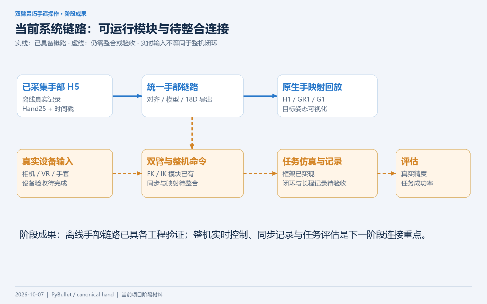
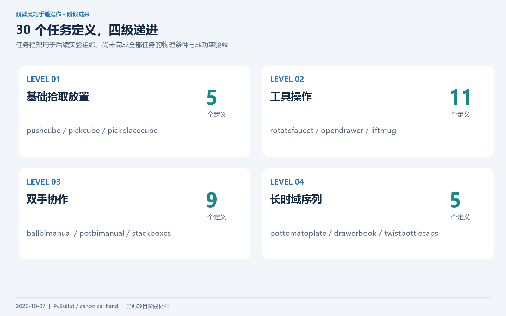
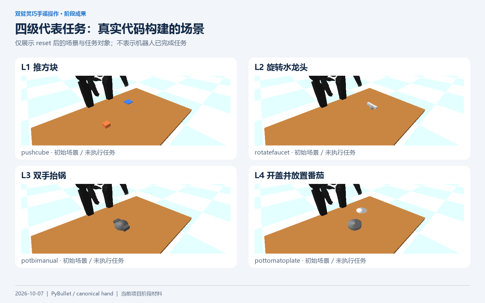
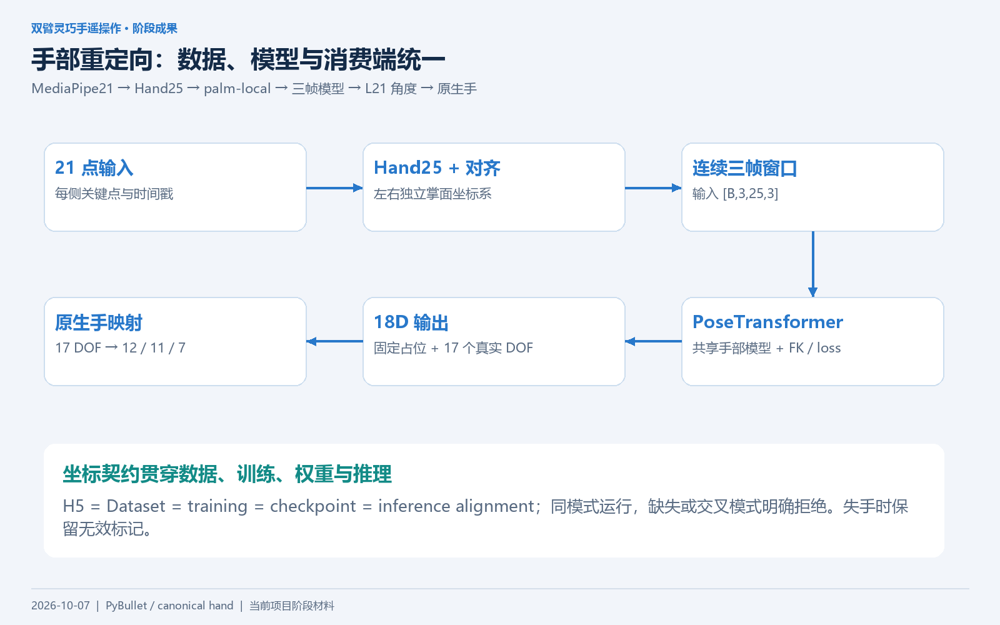
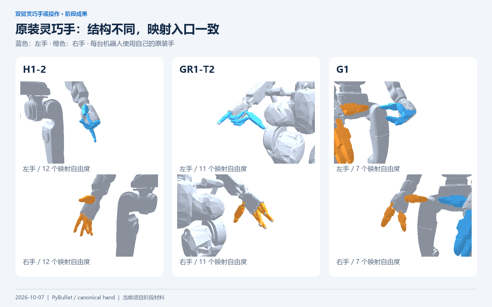
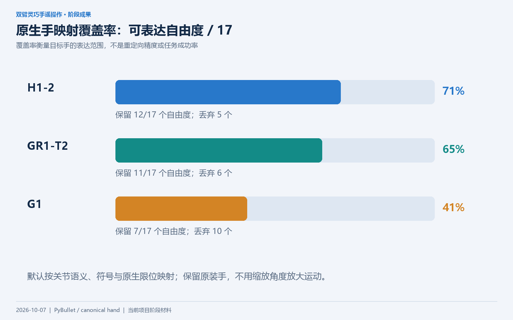
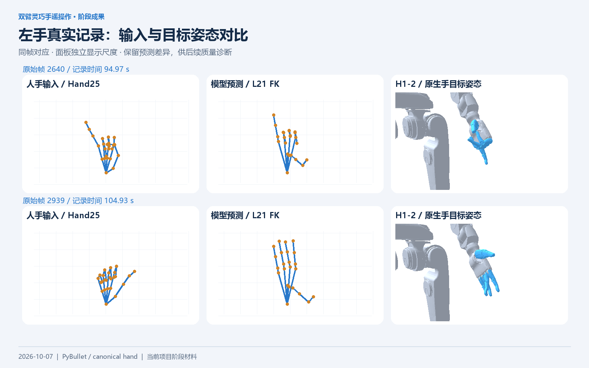
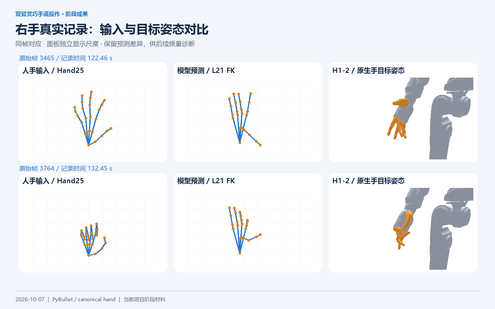
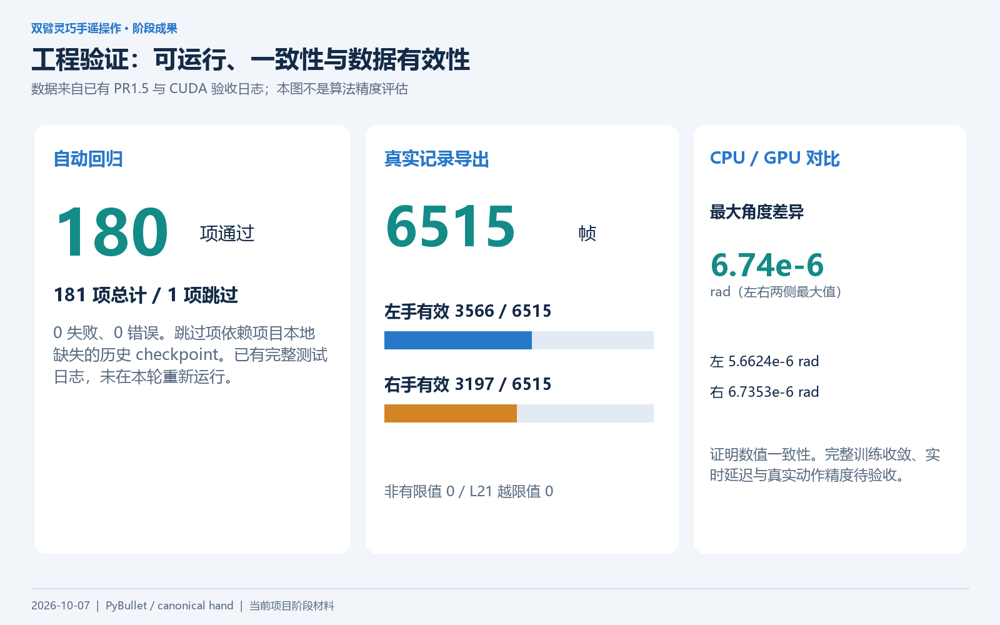

# 双臂灵巧手遥操作系统：阶段成果汇报

**项目性质：** 中山大学大学生创新创业训练计划项目  
**状态日期：** 2026-10-07  
**代码基准：** `fix/application-entrypoints` 分支，HEAD `c57c165`  
**材料范围：** 当前项目代码、已有验收日志与真实手部记录；本轮新增图片和短视频展示。

## 一、项目目标与阶段定位

本项目面向双臂人形机器人的遥操作数据采集与动作重定向算法验证。最终目标是让真实人类输入经过手部重定向和双臂 IK，形成明确的机器人关节命令，在仿真中执行操作任务，并同步记录输入、控制、执行状态与任务结果，支持离线回放和可复现评估。

当前已完成仿真框架、任务定义、手部模型工程链路、原装灵巧手映射与回放工具的建设。最明确的可运行路径是**已有手部记录 → 对齐数据 → 模型角度输出 → 原生手映射展示**。实时整机连接和任务闭环仍是下一阶段工作。

图中实线表示已有可运行连接，虚线表示待整合或验收的连接。相机实时预测、手部文件回放和任务仿真目前各有入口，尚未统一成已验收的整机实时应用。

## 二、平台与任务框架成果

### 1. 三机器人统一仿真框架

项目基于 PyBullet，接入 Unitree H1-2、Fourier GR1-T2 和 Unitree G1。机器人加载器通过关节名称建立动作映射，支持模型切换与动作回放，为不同机器人上的手部重定向展示提供统一环境。

| 机器人 | 原装手 | 每手映射自由度 | Benchmark 动作维度 |
|---|---|---:|---:|
| H1-2 | Inspire | 12 | 38 |
| GR1-T2 | Fourier 原生手 | 11 | 36 |
| G1 | 轻量三指手 | 7 | 28 |

Benchmark 动作按照左右臂、左右手的关节名称排列。已有 TRON2A＋L21 双臂命令为另一套 48 维动作空间，需要显式转换后才能连接这些机器人，不能直接按维度或索引套用。

### 2. 四级 30 个任务定义

项目实现任务注册、初始场景构建、动作执行入口与成功条件，按操作复杂度组织四级任务。

| 层级 | 类型 | 数量 | 代表任务 |
|---|---|---:|---|
| Level 1 | 基础拾取放置 | 5 | 推方块、拾取方块、放置方块 |
| Level 2 | 工具操作 | 11 | 旋转水龙头、开抽屉、抬杯子 |
| Level 3 | 双手协作 | 9 | 双手传球、双手抬锅、堆叠箱子 |
| Level 4 | 长时域序列 | 5 | 开盖并放置番茄、抽屉取书、拧瓶盖 |

场景图由实际任务代码 `reset(randomize=False)` 构建，未施加完成任务的控制策略。30 个定义构成实验组织基础，全部任务的物理合理性和成功判定尚需逐项验证；本材料不报告任务成功率。

### 3. 仿真应用与评估基础

已有环境步进、域随机化、状态记录、动作回放、成功率与完成时间统计框架。应用入口已修复动作维度初始化、单独 demo 不执行、重复 reset 的地面路径以及角度检查兼容入口问题。关闭记录的完整 demo 和单任务入口已有正常退出记录。

这些成果提升了应用可运行性与可维护性。当前默认长程记录仍存在资源问题，耗尽步数时的结果统计也有缺口，因此尚未形成完整的闭环评估结论。

## 三、手部重定向与跨机器人适配成果

### 1. 统一手部工程链路

项目已将生产手部实现整合到本仓库，减少重复维护。统一入口提供对齐、训练、导出、检查和实时推理能力。

输入由 MediaPipe21 转换为 Hand25，进行左右独立的掌面坐标对齐后，组织连续三帧窗口。PoseTransformer 接收 `[B,3,25,3]`，输出 `[B,18]`，其中第 0 维是固定占位，其余 17 维对应 L21 的可动自由度。训练通过 FK 与已有损失函数建立关键点和关节输出之间的联系。

工程上统一了 H5、Dataset、训练、checkpoint 与推理的坐标模式声明，同模式允许运行，缺失或交叉模式明确拒绝。对无效帧和失手恢复保留有效性标记。已有实时推理模块支持左右手独立积累窗口，真实设备接入仍需现场验收。

### 2. 原装灵巧手的有损映射

采用各机器人原装手，通过关节语义、符号和原生限位映射 L21 输出。原装手缺少的侧摆等自由度被丢弃；默认执行原生限位裁剪。

| 机器人 | 保留自由度 | 丢弃自由度 | 覆盖率（四舍五入） |
|---|---:|---:|---:|
| H1-2 | 12 / 17 | 5 | 71% |
| GR1-T2 | 11 / 17 | 6 | 65% |
| G1 | 7 / 17 | 10 | 41% |

覆盖率说明目标手能表达多少输入自由度，不衡量模型精度。三种机器人各有双手无头回放通过记录；本次视频展示同一份角度在不同结构原装手上的目标姿态。

### 3. 真实记录可视化

本轮读取已有 6515 帧手部记录及对应预测角度，选择左右手各连续 300 个有效帧，制作人手输入、预测 L21 FK 与 H1 原装手映射对比。

图片和视频按原始帧号与时间戳建立对应关系，未重新训练、修复或缩放预测角度。各面板独立显示尺度，模型输出和输入之间的形状差异保留在画面中。这些材料支持直观观察与质量诊断，尚不能提供定量精度结论。

## 四、工程验证成果

| 验证内容 | 已有结果 | 证据含义 |
|---|---|---|
| PR1.5 完整回归 | 181 项，180 通过、1 跳过、0 失败、0 错误 | 覆盖工程实现与应用边界；跳过项预期的本地历史权重缺失 |
| 真实手部记录导出 | 6515 帧，左右均为 `(6515,18)` | 验证真实记录的批量导出链路 |
| 有效帧 | 左 3566、右 3197 | 两侧有效性分别记录；有效帧不等于精度合格帧 |
| 数值与 L21 限位检查 | 非有限值 0、越限值 0 | 导出值有限并满足 L21 输出限位；原生手仍可能进一步裁剪 |
| CPU／GPU 最大角度差异 | 左 `5.6624e-6 rad`，右 `6.7353e-6 rad` | 验证推理数值一致性 |
| GPU 训练 smoke | 40 帧 synthetic 数据，完成 1 epoch | 训练和 checkpoint 写出路径可运行，未证明完整训练收敛 |
| 原生手回放 | H1-2／GR1-T2／G1 各双手 40 帧无头回放通过 | 映射与加载工程链路可运行 |
| 应用入口 | 完整 no-record demo／task 正常退出 | 未证明操作任务成功 |

正式环境是 Conda `teleoperation` / Python 3.10.20，CUDA 验收采用 RTX 4050 Laptop。已有 CPU 环境干净安装与重建验证；当前 CUDA 声明的从零重建尚未复验。

以上数字来自已有验收文件，本轮没有重新运行完整测试、训练或硬件实验。新生成素材的验证包括输入哈希保护、图片格式与布局检查、四段视频完整解码以及本地链接检查，详见 [验收结果](验收结果.json)。

## 五、展示材料与汇报表述

| 展示 | MP4 | 动图 | 可说明的成果 |
|---|---|---|---|
| 左手三面板对比 | [左手视频](videos/left_comparison.mp4) | [GIF](videos/left_comparison.gif) | 输入、预测 FK 与目标手映射可逐帧对应 |
| 右手三面板对比 | [右手视频](videos/right_comparison.mp4) | [GIF](videos/right_comparison.gif) | 右手独立处理与可视化 |
| 三机器人左手 | [左手跨机器人视频](videos/three_robots_left.mp4) | [GIF](videos/three_robots_left.gif) | 同一输入角度映射至不同手部结构 |
| 三机器人右手 | [右手跨机器人视频](videos/three_robots_right.mp4) | [GIF](videos/three_robots_right.gif) | 右手符号与关节语义适配 |

每段视频 10 秒，MP4 为 1280×720 / 15 fps，无声；GIF 为 640×360 / 5 fps。视频采用直接目标姿态渲染，手臂和其他身体关节保持姿态。播放时间依据原始记录时间轴，输出帧率不代表推理速度或控制频率。

**可直接用于阶段汇报的一段话：**

> 目前项目已搭建支持 H1-2、GR1-T2、G1 的双臂灵巧手遥操作仿真框架，组织了四级共 30 个操作任务定义，并完成手部关键点预处理、坐标对齐、模型训练与推理、角度导出以及原装灵巧手映射的统一工程链路。已有 180 项测试通过和 6515 帧真实记录导出结果，制作了左右手重定向与跨机器人映射展示。下一阶段将重点诊断模型质量和记录资源问题，接通真实输入、双臂校准与整机命令，进一步完成任务执行、同步记录和量化评估。

## 六、项目贡献、参考来源与后续工作

### 项目贡献与开源参考

本项目参考 TeleOpBench 的双臂灵巧手遥操作基准方向，机器人模型资产来自其开源资源，灵巧手模型及接口参考 LinkerHand 相关资产。手部实现由既有 `mytrans` 实现整合而来，当前生产维护入口统一在本仓库。

可归纳的工程贡献包括：多机器人 PyBullet 平台与分层任务定义；手部模型链路及严格坐标契约的集成；原装手语义映射与诊断可视化；应用入口修复、回归保护与正式环境建设。本材料不将机器人资产或既有模型架构描述为原创算法，也不将当前平台称为已完整复现论文的实验性能。

### 待完成项

| 方向 | 当前缺口 | 下一步 |
|---|---|---|
| 记录资源与稳定性 | 默认逐步缓存双相机图像；短程探测每步新增约 11 MB；10000 步约 103 GiB 是估算。曾出现 native crash，根因未确认 | 独立诊断缓存和异常退出，串行复验原始长程入口 |
| 手部模型质量 | 输入与预测 FK 存在差异，部分拇指关节运动不足；精度尚未验收 | 建立关键点／指尖误差、运动范围和失败样例分析 |
| 整机命令 | 48D TRON2A＋L21 与 38／36／28D benchmark 顺序、关节范围不同；有效性控制语义待统一 | 定义显式消费端转换、关节名映射及失效保持策略 |
| 真实输入与双臂 | 相机／VR／手套现场验收、手臂输入同步、真实校准和 IK／安装关系未完成 | 真实数据联调与左右臂独立控制验证 |
| 任务与评估 | 全部任务物理条件、成功判定及成功率未逐项验收；超时结果统计有缺口 | 接通输入、执行、记录与回放，固定数据／版本后开展量化评估 |

已有双臂模块含左右 7DOF FK／IK、URDF 链检查、校准接口与 TRON2A＋L21 命令路径；外部 URDF 下单测通过，实测标定与整机场景仍需验收。

建议推进顺序：**记录稳定性诊断 → 命令与机器人映射统一 → 真实输入及双臂联调 → 任务闭环与模型质量量化评估**。
